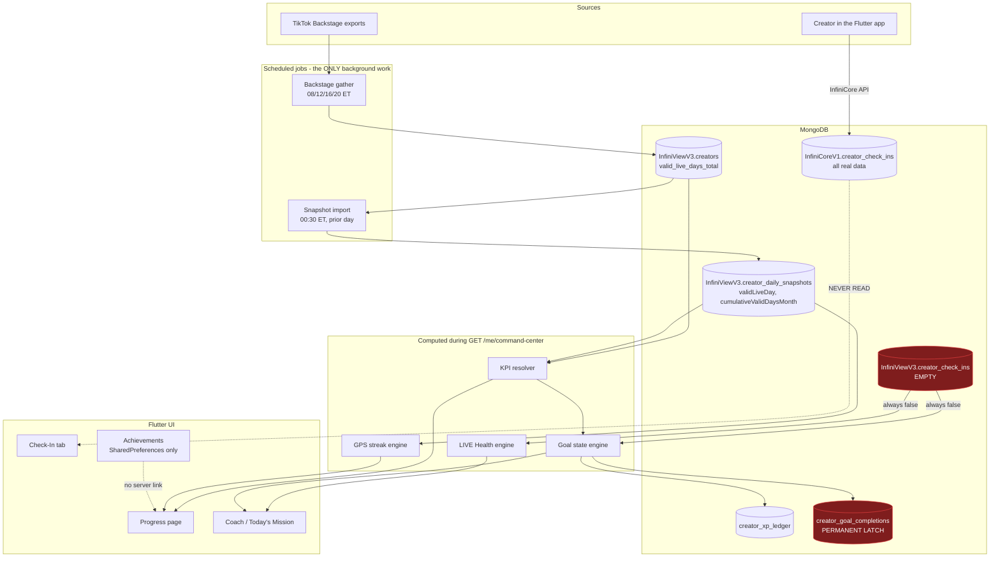

# Root Cause Report — Creator Progress, Streaks & Achievement Sync

**Investigation date:** 2026-08-05
**Author:** Kevin Doyle Jr. / Infinitum Imagery LLC
**Test creator:** `bellavlogzdaily` (`creatorId 7637323129831997454`)
**Status:** Investigation complete. Fixes landed for **RC-1, RC-2, RC-3, RC-4, RC-5, RC-6.1–RC-6.6, RC-7, RC-8.1–RC-8.3** (2026-08-05). RC-6.4 remainder (follow/video/story surfaces) remains open (no product surface yet).
**Reproduction tool:** `Infiniview-V3-Unified-App/backend/scripts/infiniviewProgressionForensicsInspect.ts` (read-only)

---

## Executive Summary

Every reported symptom was reproduced against production data. The progression system is not broken in one place — it is **four independent systems that each believe they own the same numbers**, joined by a permanent write-once latch that turns any single bad reading into a permanent wrong value.

Two defects are critical and actively corrupting data right now.

| # | Issue | Severity | Impact |
|---|---|---|---|
| RC-1 | August goals were auto-completed on Aug 1 using **July's** numbers, then permanently latched | **Critical** | 29 of 39 creators; 119 false completions; 9,630 XP awarded for work never done |
| RC-2 | Weekly check-ins are **written to one database and read from another** | **Critical** | Check-in prompt never clears; LIVE Health permanently penalized for all creators |
| RC-3 | Streak reads per-day flags while the KPI reads monthly totals — they can never agree | High | Streak shows 0 while Progress shows 3 valid days |
| RC-4 | Valid LIVE Days has 4 disagreeing sources and can decrease | High | "7 became 6"; Progress, My Stats, and Coach show different numbers |
| RC-5 | `asOfDate` is the last snapshot date, not today — everything is a day behind | Medium | Today's LIVE never counts; pace and projections off by one day |
| RC-6 | Achievement points are entirely client-side, device-local, and unsynced | Medium | Points differ per device; ~40 achievements can never unlock |
| RC-7 | Leaderboard cache has a 24h TTL with no scheduled refresh and orphaned keys | Medium | Standings lag reality by up to a day |
| RC-8 | Six different day-boundary conventions across the stack | Medium | Off-by-one-day bugs at month, week, and day rollover |

### The single most important finding

There is **no background pipeline**. The intended chain —

```
LIVE Sync → Valid Day Update → Streak Update → Achievement Update → Leaderboard Update
```

— does not exist as wired jobs. Only the first two stages run on a schedule. Streaks, XP, and goal completions are computed **and written** during a `GET /me/command-center` request. Achievements run entirely on the user's phone. This is why ordering guarantees are absent and why a single early-morning API call on the 1st of the month was able to permanently corrupt the whole roster's goals.

---

## Phase 1 & 7 — Reproduction and Timeline (`bellavlogzdaily`, August 2026)

### Observed values, all read directly from production

| Surface | Value | Source of truth it reads |
|---|---|---|
| Roster valid LIVE days (MTD) | **3** | `creators.valid_live_days_total` |
| Snapshot cumulative valid days | **2** | `creator_daily_snapshots.cumulativeValidDaysMonth` |
| Sum of per-day valid flags | **2** | `creator_daily_snapshots.validLiveDay` |
| Valid LIVE days (L30D) | **13** | `creators.valid_live_days_l30d` |
| Current streak | **0** | Recomputed from per-day flags |
| Weekly check-in (Check-In tab) | **Submitted** | `InfiniCoreV1.creator_check_ins` |
| Weekly check-in (Home / Coach / LIVE Health) | **Not submitted** | `InfiniViewV3.creator_check_ins` |
| Achievement XP | **1,300** | `creator_xp_ledger` |
| `performance_data_period` | `2026-08-01 ~ 2026-08-05` | Backstage export |

### Day-by-day timeline

| Date | Status | LIVE hrs | Diamonds | Valid? | Cum. valid | Note |
|---|---|---|---|---|---|---|
| 2026-08-01 | **NO ROW** | — | — | — | — | Archive gap |
| 2026-08-02 | complete | 1.39 | 101 | **YES** | 1 | "Month start — daily equals MTD cumulative" |
| 2026-08-03 | complete | 1.12 | 9 | **YES** | 2 | |
| 2026-08-04 | complete | 0.16 | 0 | no | 2 | Short session, below the 61-minute rule |
| 2026-08-05 | **NO ROW** | — | — | — | — | Today; import runs 00:30 ET tomorrow |

**The exact day values diverged: 2026-08-01.** No snapshot exists for August 1. That single gap is what triggered RC-1, and it is why the August 2 row is labelled "Month start" even though it is the second of the month.

---

## Root Causes

### RC-1 — Month-rollover contamination permanently completes goals (CRITICAL)

**Files:**
- `Infiniview-V3-Unified-App/backend/src/services/infiniviewCommandCenterKpiResolver.ts:167-177`
- `Infiniview-V3-Unified-App/backend/src/services/infiniviewCreatorGoalStateEngine.ts:286-315, 544-565`
- `Infiniview-V3-Unified-App/backend/src/services/infiniviewCommandCenterService.ts:342, 390-396, 433-456`

**What happens.** On the first day of a month there are no daily snapshots yet. The KPI resolver hits this branch:

```167:177:Infiniview-V3-Unified-App/backend/src/services/infiniviewCommandCenterKpiResolver.ts
  if (!hasContributingSnapshots && masterHasMetrics) {
    infiniviewLogDebug(
      `KPIs resolved from master sheet monthly fields (total_diamonds / live_duration_total_hours / valid_live_days_total)`,
      INFINIVIEW_COMMAND_CENTER_KPI_RESOLVER_SOURCE
    );
    return {
      kpis: masterKpis,
      kpiSource: "master_sheet_monthly",
      validDaysSource: "master_sheet_monthly",
    };
  }
```

The month key is resolved from the wall clock in America/New_York, so it is already `2026-08`. But the master roster row still holds **July's** final totals, because the Backstage gatherer has not yet produced an August Creator Data export. The resolver therefore returns July's numbers **labelled as August**.

The guard that should have caught this is one branch above it — `masterIsAuthoritative` checks that `performance_data_period` starts with the requested month. That guard correctly returns `false` on August 1. The bug is that failing the guard falls through into the unguarded fallback rather than refusing to resolve.

The goal state engine then compares those numbers to August's targets, marks everything complete, and the caller persists the completions and awards XP. Completion is a permanent latch by design:

```544:552:Infiniview-V3-Unified-App/backend/src/services/infiniviewCreatorGoalStateEngine.ts
  // Anything complete from live data but not yet persisted needs recording so that a later lagging
  // snapshot cannot reopen it. Composite goals are persisted too, so "monthly goal achieved" has a
  // durable timestamp for achievements and notifications.
  const pendingCompletions: InfiniviewCreatorGoalCompletionUpsert[] = goals
    .filter(
      (goal) =>
        infiniviewCreatorGoalStateIsSatisfied(goal.state) &&
        !goal.isSyncing &&
        goal.firstCompletedAt == null
    )
```

**Proof from production.** `bellavlogzdaily`, persisted `2026-08-01T15:41:02.441Z`:

```json
{"goalId":"tier_requirement_valid_days","periodId":"2026-08","completedValue":14,
 "targetValue":8,"completionSource":"master_sheet_monthly",
 "firstCompletedAt":"2026-08-01T15:41:02.441Z"}
```

`completedValue: 14` is July's valid-day count. Her actual August valid days are **3**. The same timestamp also latched `tier_requirement_diamonds` at 1,404 (July's diamonds; August actual: 126) and `tier_requirement_live_hours` at 29.32 (August actual: 5.13).

**Blast radius, measured across the roster:**

- 134 total persisted completions for `2026-08`
- **119** of them latched on day 1–2 of the month from `master_sheet_monthly`
- **29 of 39** creators affected
- **9,630 XP** awarded for August goal completions

**Systems affected:** monthly goals, tier requirements, XP ledger, Coach directive, Today's Mission, Progress page, Graduation tracker, achievements driven by goal completion.

**Why it recurs:** this fires every single month on the 1st, for every creator whose app calls Home before the first August snapshot lands.

---

### RC-2 — Weekly check-ins are written to a different database than they are read from (CRITICAL)

**Files:**
- Write path: `Infiniview-V3-Unified-App/lib/features/check_in/repositories/remote_check_in_repository.dart:71-74` (InfiniCore client)
- Provider wiring: `lib/features/check_in/providers/check_in_providers.dart:25-27` (this is the **only** implementation)
- Read path: `backend/src/services/infiniviewCreatorCheckInService.ts:13, 179` (`infiniviewConnectMongo`)
- Config: `Infiniview-V3-Unified-App/.env:192` → `InfiniViewV3`; `InfiniCore API/.env:10` → `InfiniCoreV1`

Both databases live on the same cluster, which is why this was never caught by a connectivity check.

**Proof from production** for `bellavlogzdaily`:

```
InfiniViewV3.creator_check_ins  (READ by Command Center):  0 rows
InfiniCoreV1.creator_check_ins  (WRITTEN by the app):      4 rows
    weekStart=2026-08-03  submittedAt=Mon Aug 03 2026 14:56:32 GMT-0400
    weekStart=2026-07-27  submittedAt=Mon Jul 27 2026 02:50:16 GMT-0400
    weekStart=2026-07-20  submittedAt=Tue Jul 21 2026 17:39:18 GMT-0400
    weekStart=2026-07-13  submittedAt=Sun Jul 12 2026 21:05:33 GMT-0400
```

This answers the Phase 6 question exactly. She submitted **Monday Aug 3 at 2:56 PM ET**, the current week key is `2026-08-03`, and Command Center still computes `hasWeeklyCheckInThisWeek: false`.

The week-boundary logic is **not** at fault — both services compute an identical UTC-Monday key (`infiniviewCreatorCheckInService.ts:67-72` and `infinicoreCreatorCheckInService.ts:51-56` are byte-identical). The databases are simply different.

**Downstream damage.** LIVE Health hard-codes a 65-point penalty for a missing check-in:

```246:250:Infiniview-V3-Unified-App/backend/src/services/infiniviewCommandCenterLiveHealthEngine.ts
  const communityScore = input.weeklyCheckInCompletedThisWeek ? 100 : 35;
```

So every creator permanently scores 35 instead of 100 on community engagement, permanently shows "Submit your weekly check-in for accountability" in **Need Work**, permanently sees the Today's Mission row incomplete, and the `weekly_check_in` goal never completes.

**Answering Phase 6 question 6** — the four surfaces do *not* read the same field:

| Surface | Field it reads | Database |
|---|---|---|
| Check-in completion (Check-In tab) | `hasWeeklyCheckInThisWeek` | **InfiniCoreV1** |
| Reminder / Today's Mission | `todayMission.tasks[weekly_check_in].state` | InfiniViewV3 |
| LIVE Health | `weeklyCheckInCompletedThisWeek` → `liveHealth.strengths` | InfiniViewV3 |
| Need Work | `liveHealth.needsWork` | InfiniViewV3 |

The first row is the outlier, and it is the only one the creator's submission actually reaches.

---

### RC-3 — Streaks and KPIs read different data and can never agree (HIGH)

**Files:** `backend/src/services/infiniviewCommandCenterGpsEngine.ts:613-641, 683-714`

The streak walks backward from `asOfDate` over per-day boolean flags:

```626:641:Infiniview-V3-Unified-App/backend/src/services/infiniviewCommandCenterGpsEngine.ts
function infiniviewCommandCenterGpsEngineCountStreakEndingAt(
  endDate: string,
  validityMap: Map<string, boolean>
): number {
  let streak = 0;
  let cursor = endDate;

  while (validityMap.has(cursor)) {
    if (validityMap.get(cursor) !== true) {
      break;
    }
    streak += 1;
    cursor = infiniviewCommandCenterGpsEngineAddDaysToIsoDate(cursor, -1);
  }

  return streak;
}
```

**Answering the Phase 3 core question:** streak consumes **(b) raw per-day snapshot flags**, never the `validLiveDays` KPI. The KPI comes from a completely different path (`cumulativeValidDaysMonth`, or the master sheet). Two numbers, two sources, displayed side by side.

**Three distinct failure modes, all confirmed:**

1. **One short day zeroes the streak.** `bellavlogzdaily` went live Aug 2 (1.39h, valid) and Aug 3 (1.12h, valid), then Aug 4 for 0.16h. Because the walk starts at `asOfDate` = Aug 4 and Aug 4 is invalid, it breaks immediately and returns **0** — not "2 days ending Aug 3". A 10-minute session destroys the visible streak.
2. **A missing sync is indistinguishable from not going live.** `validityMap.has(cursor)` is false for an absent date, so the walk stops. A gatherer outage silently breaks every creator's streak.
3. **Today can never count.** See RC-5.

---

### RC-4 — Valid LIVE Days has four disagreeing sources and can decrease (HIGH)

**Answering "Is there one source of truth?" — no. There are four:**

| Source | Value for `bellavlogzdaily` | Where |
|---|---|---|
| Backstage MTD | 3 | `creators.valid_live_days_total` |
| Backstage rolling 30-day | 13 | `creators.valid_live_days_l30d` |
| Snapshot cumulative | 2 | `creator_daily_snapshots.cumulativeValidDaysMonth` |
| Sum of per-day flags | 2 | `creator_daily_snapshots.validLiveDay` |

**Answering "Why would 7 become 6?" — three independent mechanisms, all real:**

**(a) The master-authoritative path has no floor.** When `performance_data_period` starts with the current month, the resolver returns the master sheet value outright with no `Math.max` protection (`infiniviewCommandCenterKpiResolver.ts:155-165`). The gatherer overwrites that field with `$set` on every run (~4×/day), and `valid_live_days_*` is deliberately excluded from the preserve-on-null list. Any TikTok recount, parse miss, or empty export cell lowers the number immediately.

**(b) A missing archive day permanently collapses two valid days into one.** The delta engine returns a **boolean per row**, not a count:

```85:101:InfiniView-V3 Backstage Gatherer/src/snapshotHistory/gathererSnapshotDeltaEngine.ts
function gathererSnapshotDeltaEngineResolveValidLiveDay(
  dailyLiveHours: number | null,
  cumulativeValidDays: number | null,
  priorCumulativeValidDays: number | null
): boolean {
  if (
    cumulativeValidDays !== null &&
    priorCumulativeValidDays !== null &&
    cumulativeValidDays > priorCumulativeValidDays
  ) {
    return true;
  }
  if (dailyLiveHours !== null && dailyLiveHours >= GATHERER_SNAPSHOT_VALID_LIVE_DAY_MIN_HOURS) {
    return true;
  }
  return false;
}
```

If day N has no archive row, day N+1's cumulative jumps by 2 — but the function still returns a single `true`. Two real valid days become one flag, forever. The math engine already detects this and raises `VALID_DAYS_RECONSTRUCTION_INCOMPLETE` (`infiniviewSnapshotMathEngine.ts:340-349`), but nothing acts on the warning.

**(c) Window switching.** MTD resets to 0 at month rollover while L30D does not, and the gatherer has a hybrid-export fallback that can map an L30D column into the MTD field (`gathererBackstageFieldAliasCatalog.ts:326-330`).

**Recalculated or incremented?** Fully replaced on every gather run via `$set` upsert — never incremented. This is why decreases are possible at all.

---

### RC-5 — `asOfDate` is the last snapshot date, not today (MEDIUM)

**File:** `backend/src/services/infiniviewSnapshotMathEngine.ts:276-285`

```276:285:Infiniview-V3-Unified-App/backend/src/services/infiniviewSnapshotMathEngine.ts
export function infiniviewSnapshotMathEngineBuildPeriod(
  snapshots: InfiniviewCreatorDailySnapshotDocument[],
  month: string
): InfiniviewCommandCenterPeriod {
  const latest = infiniviewSnapshotMathEngineLatestContributingSnapshot(snapshots);
  return {
    month,
    asOfDate: latest?.snapshotDate ?? null,
  };
}
```

The snapshot importer runs at 00:30 ET and imports the **previous** day. So `asOfDate` is always at least one day behind the wall clock — confirmed: `asOfDate = 2026-08-04` while the investigation ran on 2026-08-05.

Every downstream calculation inherits the lag: `daysElapsed`, pace, the MTD projection `(validLiveDays / daysElapsed) * daysInMonth`, the streak endpoint, and today's mission completion. A creator who goes live right now cannot see it reflected until tomorrow, which reads as "the app didn't count my stream."

*(Note: I verified the snapshot query sorts `snapshotDate: 1` at `infiniviewSnapshotDailyMongoService.ts:51`, so taking the last array element is correct. That is not a bug.)*

---

### RC-6 — Achievement points are client-side, device-local, and unsynced (MEDIUM)

There are **three unrelated point systems** that never reconcile:

| System | Storage | Scope |
|---|---|---|
| Community achievements (93 badges) | SharedPreferences + Firestore `leaderboard` | Device → **per-account (fixed 2026-08-05)** |
| Creator Academy gamification | Firestore `user_gamification` | Account |
| Command Center XP | Mongo `creator_xp_ledger` | Account |

Confirmed defects:

- **Double daily-login credit. ✅ FIXED (RC-6.1)** Daily login bonus (+5/day) is now recorded in a local ledger (`infiniview_achievements_login_bonus_total`) and included in `infiniviewAchievementsTotalPoints()`, so Progress and Firestore increment the same two parts. The one-time `daily_login` achievement (+5) remains a separate unlock award by design.
- **`SyncTotalPoints` is dead code. ✅ FIXED (RC-6.2)** Absolute sync cannot work with period-bucketed boards (it would write lifetime totals into today's bucket). Removed `SyncTotalPoints` / absolute write payloads. Durability is now a per-account pending-award queue flushed on session start, plus `FieldValue.increment` so concurrent devices cannot lose awards.
- **Storage key is not per-user. ✅ FIXED (RC-6.3)** `InfiniviewAchievementsUserScope` scopes achievement state, login-bonus ledger, streaks, pending awards, and tracker dedupe logs per username. First account after upgrade claims the legacy device-wide values once; other accounts on that device start clean. Legacy owner mirrors writes for downgrade safety.
- **~40 of 93 achievements have no trigger. (RC-6.4, mostly resolved)** Audit 2026-08-05: `share`, `live_support`, `live_boost_join`, and `live_going_live_day` already have call sites. Remaining unwired keys (`follow`, `video`, `story` + their `special_first_*`) have **no product surface yet** — leave dormant until those features ship.
- **Streak achievements measure the wrong thing. ✅ FIXED (RC-6.5)** Streak badges now sync from Command Center `currentValidLiveDays` / `longestValidLiveDaysThisMonth`. App-login streak only gates the daily login bonus. Catalog copy updated to "valid LIVE day streak (61+ minutes)".
- **Three point systems never reconcile. ✅ FIXED (RC-6.6)** Community achievements + Command Center XP are merged into one **Creator Score** via a bidirectional idempotent bridge (local score includes bridged `liveXp`; achievement unlocks/login POST into Mongo `creator_xp_ledger`; one-time legacy join). Creator Academy gamification stays a separate product ledger by design.

---

### RC-7 — Leaderboard cache is stale by design (MEDIUM)

**File:** `backend/src/services/infiniviewCommunityLeaderboardService.ts:40, 536-627, 732-736`

- TTL is **86,400,000 ms (24 hours)** (`infiniviewApiConfig.ts:257`).
- `infiniviewRefreshCreatorLeaderboardCache` exists but has **zero call sites** — nothing refreshes the cache on a schedule. It only rebuilds lazily on a cache miss or explicit `?refresh=true`.
- Nothing invalidates it after the gatherer publishes, and `infiniviewClearMasterCreatorDataCache` is likewise never called.

Production state — three cache documents, two of them orphaned by past key renames:

```
cache_key=latest      builtAt=2026-06-30T17:46:34Z   age=867h
cache_key=latest_v2   builtAt=2026-07-14T22:49:36Z   age=526h
cache_key=latest_v3   builtAt=2026-08-05T10:54:21Z   age=10h
```

The live key is healthy at 10h, so this is less severe than it first appears, but standings can legitimately lag reality by a full day and the orphaned rows should be cleaned up.

---

### RC-8 — Six different day-boundary conventions (MEDIUM)

| Convention | Where | Used for | Status |
|---|---|---|---|
| America/New_York calendar | `infiniviewAgencyCalendar.ts` (shared) | Month key, evaluationDate, warming | ✅ Canonical for Command Center |
| UTC Monday | `infiniviewCreatorCheckInService.ts` | Check-in week labels | Kept — persisted keys; migration required to change |
| America/New_York **8 PM cutoff** business day | Gatherer `dates.ts` | Daily archive folder / sheet tab names | Kept — final archive closing key == ET calendar day |
| Plain UTC ISO arithmetic on `YYYY-MM-DD` | GPS `AddDaysToIsoDate` | Streak walk day math | Kept — date-label arithmetic is zone-independent |
| Device local → America/New_York | Flutter achievements login/periods/countdowns | Client streaks + boards | ✅ Fixed (RC-8.3) — Academy stays device-local (separate ledger) |
| Server local | Warming (was) | Warming state | ✅ Fixed → agency calendar |

**RC-8.1 ✅ FIXED** — Command Center `evaluationDate` was `toISOString().slice(0, 10)` (UTC). During EDT that rolls at **8 PM ET**, so late-evening dashboards treated the day as already closed while snapshot labels and the month key were still on the ET calendar day. Both the service and the GPS default now resolve "today" through `infiniviewAgencyCalendarResolveDateKey` (America/New_York).

**RC-8.2 ✅ FIXED** — TikTok monthly warming used `referenceDate.getFullYear()` / `getMonth()` (deploy-host local) while `lastLive` compared UTC components. Warming and last-live month checks now use `infiniviewAgencyCalendarResolveYearMonth`.

**RC-8.3 ✅ FIXED** — Flutter client now resolves America/New_York via `lib/core/time/infiniview_agency_calendar.dart` for: achievements login-bonus day boundary, holiday unlock day, leaderboard period suffixes, going-live/profile-view dedupe keys, and Creator Ranks / Achievements "Resets in" countdowns. Creator Academy gamification daily windows remain device-local (separate product ledger; see RC-6.6).

---

## Dependency Diagram



**Duplicate calculations, highlighted:**

- Valid LIVE days: computed 4 ways (RC-4)
- Streaks: 5 independent implementations (Command Center, gamification Firestore, achievements login, academy learning, plus an unwired `trackDailyLogin`)
- Points: Creator Score merges achievements + CC XP; Academy stays separate (RC-6.6)
- Week start: duplicated verbatim in two services instead of using the shared `infiniviewCreatorGoalPeriodResolver`

---

## Recommended Fix Order

Ranked by impact, with the cheapest high-impact fixes first.

| # | Fix | Effort | Why this order |
|---|---|---|---|
| 1 | **Point check-in reads and writes at one database.** Either have InfiniView read `InfiniCoreV1`, or migrate and dual-write. | Low | One-line config/client change unblocks LIVE Health, Today's Mission, Coach, and the weekly goal for every creator |
| 2 | **Stop the month-rollover latch.** Refuse to resolve KPIs from the master sheet when `performance_data_period` does not cover the requested month; return `unavailable` and mark goals `isSyncing` instead of complete. | Low | Prevents recurrence on Sep 1. Must ship before month end |
| 3 | **Reconcile the 119 false August completions** and reverse the associated XP. | Medium | Data repair; requires a decision on whether to claw back XP |
| 4 | **Make the streak tolerant.** End the walk at the last *valid* day rather than `asOfDate`, and distinguish "no data" from "not valid". | Medium | Fixes the 0-instead-of-2 case and gatherer-outage resets |
| 5 | **Pick one Valid LIVE Days source of truth** and have Progress, My Stats, Coach, and the streak all read it. | Medium | Ends visible disagreement between screens |
| 6 | **Backfill missing snapshot days** and act on `VALID_DAYS_RECONSTRUCTION_INCOMPLETE` instead of ignoring it. | Medium | Stops the permanent two-days-into-one collapse |
| 7 | **Wire a leaderboard refresh** after snapshot import; call `infiniviewClearMasterCreatorDataCache` after gatherer publish; drop the orphaned `latest` / `latest_v2` docs. | Low | Small, safe, removes a class of staleness |
| 8 | **Move achievement points server-side**, key storage per-user, remove the double login credit, and either wire or retire the ~40 dead achievements. | High | Largest scope; least data corruption |
| 9 | **Standardize on one day-boundary helper** (recommend the ET business day already used by the gatherer). | High | Touches everything; do last, with tests |

---

## Risk Assessment

| Fix | What could break |
|---|---|
| 1 — Check-in database | Historical InfiniView check-in rows (currently 0 for our test creator) may exist for others; verify before cutover. CRM case linkage reads `crmCaseId` and must follow. Field naming differs (`week_start` vs `weekStart`) — a reader change needs both shapes or a migration. |
| 2 — KPI resolver guard | Creators will see "syncing" instead of numbers for the first day or two of each month. This is honest but will generate support questions; pair it with clear UI copy. Goals legitimately completed at month end must not regress. |
| 3 — Reversing completions | XP clawback is creator-visible and may feel punitive. Consider zeroing the goals but leaving XP, and communicating it. Achievements and notifications already fired for these completions. |
| 4 — Streak change | Streak numbers will **increase** for many creators overnight. Any streak-milestone notification logic could fire in bulk; gate it on first run. |
| 5 — Single valid-days source | Whichever source is chosen, some creators' displayed numbers will move. Choosing snapshots lowers numbers; choosing the master sheet raises them. Decide deliberately and announce it. |
| 6 — Snapshot backfill | Rewriting `validLiveDay` retroactively changes past streaks and could re-trigger milestone achievements. Run with notifications disabled. |
| 7 — Cache refresh | Higher load on the roster read path if refresh is too frequent; keep the 24h TTL and add one post-import invalidation rather than a short TTL. |
| 8 — Server-side achievements | Migrating SharedPreferences state risks losing per-device progress. Needs a merge strategy, not a replace. |
| 9 — Timezone standardization | Highest regression risk in the codebase. Every date-keyed document would need a migration or a compatibility read. Do not attempt without full test coverage. |

---

## Regression Checklist

Everything below must be verified after any of the above changes.

**API endpoints**
- `GET /me/command-center` — KPIs, `period.asOfDate`, `streak`, `todayMission`, `liveHealth`, `goalState`, `coachDirective`
- `GET /creator/check-in/status` (InfiniCore) and `POST /creator/check-ins/weekly`
- `GET /me/check-in/status` (InfiniView) — confirm whether it should remain
- `GET /creators/leaderboards` — with and without `?refresh=true`
- `GET /dashboard` — `monthlyProgress.validDays`
- `GET /creators/:id` — `valid_live_days_total`, `valid_live_days_l30d`

**Screens**
- Home (sticky bar, Today's Mission, progress rings)
- Progress page (valid days, streak card, goal bars)
- My Stats (MTD vs L30D vs prior month)
- Coach / Command Center (directive, LIVE Health strengths and Need Work)
- Check-In tab (form vs submitted card, weekly history)
- Achievements (points total, leaderboard, streak achievements)
- Community → Top Creators (all leaderboard boards, daily and monthly)
- Creator Academy (learning streak, gamification stats)
- Graduation Center and Rookie Center (both read goal state)

**Background workers**
- Backstage gather at 08/12/16/20 ET → `creators`, `creator_performance_snapshots`
- Snapshot history import at 00:30 ET → `creator_daily_snapshots`, `creator_monthly_goals`
- Snapshot import startup catch-up (5 min after boot)
- Gatherer startup catch-up (3 min after boot)
- Firebase LIVE presence tick (every 10 min)
- Firebase community spotlight (00:05 UTC)

**Calculations**
- Valid LIVE day 61-minute rule, including the two-short-sessions case
- Valid day reconstruction vs `cumulativeValidDaysMonth` (the tolerance check)
- Streak across: a missing day, a zero-hour day, a sub-61-minute day, and month boundary
- Week key on Sunday 8 PM ET and Monday 00:00 ET
- Month rollover on the 1st at 00:00 ET, 12:00 UTC, and 8 PM ET
- MTD pace and projection when `daysElapsed` is 1
- Goal completion when targets are unavailable or still syncing
- XP exactly-once semantics under concurrent Home refreshes

**Explicit month-rollover rehearsal:** set the clock to the 1st of a month with no snapshots present and confirm that no goal completes and no XP is awarded.

---

## Open Questions Requiring a Decision

1. **Which database owns check-ins** — migrate InfiniCore data into InfiniViewV3, or repoint InfiniView's reader at InfiniCoreV1?
2. **Do we reverse the 9,630 XP** from false August completions, or absorb it and only fix forward?
3. **Which Valid LIVE Days source is canonical** — Backstage MTD (matches what creators see in TikTok Backstage) or reconstructed snapshots (internally consistent with streaks)?
4. **Should the streak end at the last valid day** (forgiving, shows 2) or strictly at `asOfDate` (current, shows 0)?

---

*Investigation performed read-only. The only file added is the diagnostic script `backend/scripts/infiniviewProgressionForensicsInspect.ts`, which performs no writes.*
