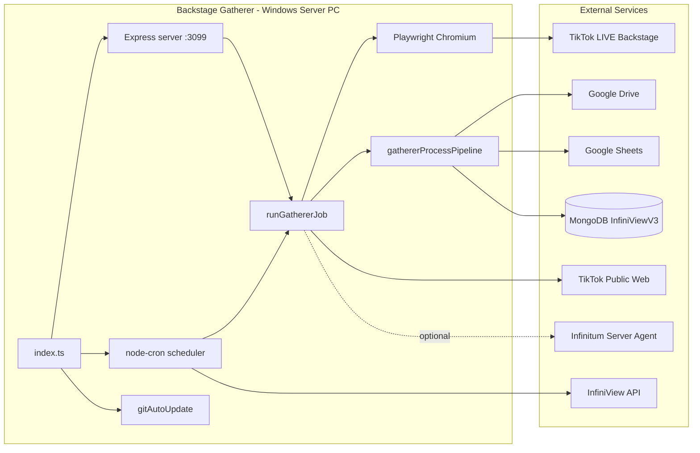
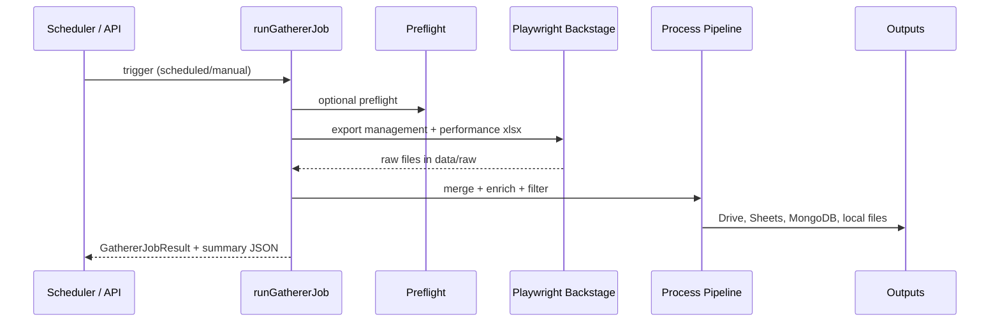
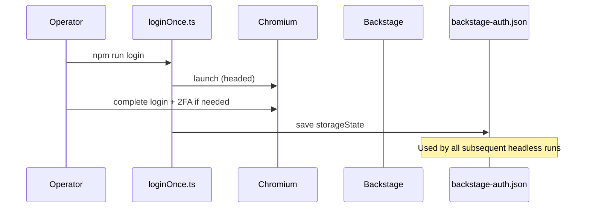
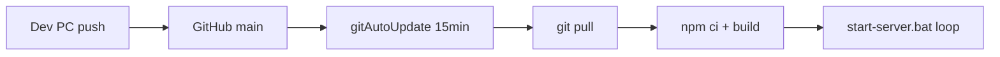

# Architecture — InfiniView V3 Backstage Gatherer

**Audit date:** 2026-07-11

---

## System context

---

## Main components

| Component | File(s) | Role |
|-----------|---------|------|
| Entry | `src/index.ts` | Bootstrap dirs, PID file, start server + scheduler + git watcher |
| Config | `src/config.ts` | Load `.env`, expose `GathererConfig` |
| Server | `src/server.ts` | Express dashboard + manual trigger routes |
| Scheduler | `src/scheduler.ts` | Cron for gathers, snapshot import, highlights |
| Gather job | `src/jobs/runGathererJob.ts` | Orchestrates export → pipeline → cleanup |
| Pipeline | `src/jobs/gathererProcessPipeline.ts` | Merge, enrich, publish |
| Backstage | `src/backstage/*` | Playwright login, export, selectors |
| Google | `src/google/*` | Drive, Sheets, auth |
| Mongo | `src/mongo/*` | Connect, indexes, publish |
| Profile Acquirer | `src/profileAcquirer/*` | TikTok public profile scrape |
| Snapshot history | `src/snapshotHistory/*` | Drive archive import engine |
| Services | `src/services/*` | Highlights scan, Infinitum Agent hooks |

---

## Request / job flow

---

## Scheduling architecture

`src/scheduler/gathererSchedulePlanner.ts` supports:

- **fixed** — `RUN_SCHEDULE_1`–`RUN_SCHEDULE_4` or comma-separated `RUN_SCHEDULES`
- **random** — jittered times within active hours (`GATHERER_SCHEDULE_MODE=random`)

Additional cron jobs registered in `src/scheduler.ts`:

| Job | Default | Env gate |
|-----|---------|----------|
| Gather runs | 08:00, 12:00, 16:00, 20:00 ET | always |
| Snapshot history import | 00:30 ET | `GATHERER_SNAPSHOT_HISTORY_IMPORT_ENABLED` |
| Auto Highlights scan | hourly 8–20 ET | `GATHERER_AUTO_HIGHLIGHTS_SCAN_ENABLED` + secret |
| Startup catch-up | 3 min after boot | `GATHERER_CATCHUP_ON_STARTUP` |

Midnight handler regenerates the daily plan for random mode.

---

## Authentication flow (Backstage)

Session refresh: `GATHERER_BACKSTAGE_FORCE_RELOGIN_HOURS` or manual `npm run login`.

---

## Deployment flow (two-PC)

Dashboard **Check for Updates** calls `POST /api/update` for immediate pull.

---

## State management

- **Run lock** — in-memory `gathererRunLock` in `runState.ts` (single process)
- **Last summary** — `data/logs/last-run-summary.json` persisted to disk
- **PID file** — `.server.pid` written at startup
- **Update lock** — `.update-lock` during git pull

No Redis or external queue.

---

## Error handling

- Job failures return `{ success: false, errors: string[] }`
- Optional failure email via Gmail API (`gathererFailureEmailNotifier.ts`)
- Highlights scan and Infinitum Agent hooks log warnings only — do not fail the gather
- `start-server.bat` restarts the Node process after exit (5 s delay)

---

## Logging

Centralized pino logger — see [OBSERVABILITY_AND_LOGGING.md](OBSERVABILITY_AND_LOGGING.md).

---

## Platform-specific behavior

- **Windows:** Primary target; PowerShell scheduled tasks in `scripts/`
- **Timezone:** `TZ=America/New_York` default; cron uses `config.timezone`
- **Playwright:** `postinstall` installs Chromium only
