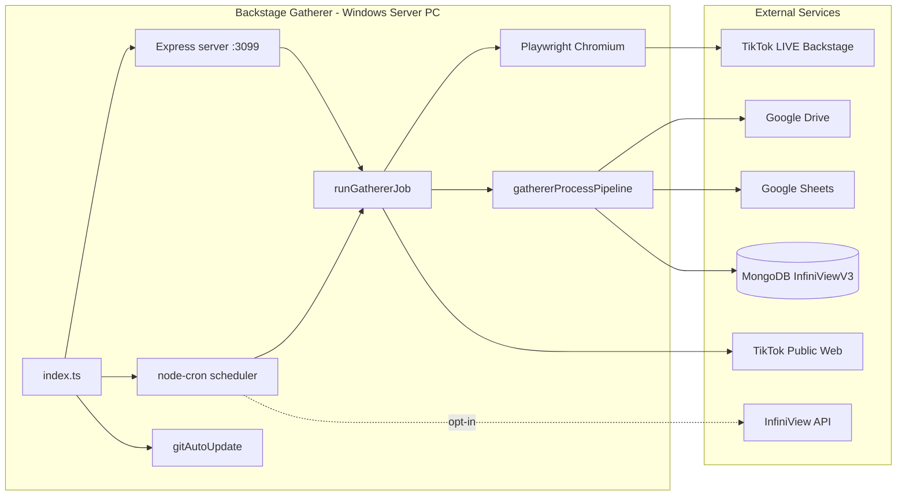

# InfiniView V3 Backstage Gatherer

---

## 1. Project name

**InfiniView V3 Backstage Gatherer** (`infiniview-v3-backstage-gatherer`)

**Owner:** Kevin Doyle Jr. / Infinitum Imagery LLC  
**Repository:** [jrftw/InfiniViewV3BackstageDataGather](https://github.com/jrftw/InfiniViewV3BackstageDataGather)

---

## 2. One-sentence description

Automated TikTok LIVE Backstage export, merge, enrichment, and publish pipeline that runs on a dedicated Windows server PC and dual-writes creator performance data to Google Drive/Sheets, local files, and MongoDB for consumption by the InfiniView V3 creator app via the InfiniView API.

---

## 3. Current repository status (evidence-based)

Status labels used throughout this document: **Implemented** | **Implemented with external configuration required** | **Partially implemented** | **Disabled** | **Experimental** | **Deprecated** | **Planned only** | **Historical** | **Unable to verify**

| Area | Status | Evidence |
|------|--------|----------|
| TypeScript compile (`npm run build`) | **Verified** | Exit 0 on audit machine (2026-07-11) |
| CI (`.github/workflows/ci.yml`) | **Implemented** | Build only — no automated tests |
| Backstage gather automation | **Implemented with external configuration required** | Playwright exports in `src/backstage/*`; requires live session |
| Enrichment (CRM, DIP, manual tabs) | **Implemented with external configuration required** | `src/processing/*`, Google Sheets readers |
| Profile Acquirer | **Implemented** | `src/profileAcquirer/*`, `npm run profile-acquire` |
| Snapshot history import | **Implemented** | Nightly job enabled by default |
| MongoDB dual-write (6 collections) | **Implemented with external configuration required** | Requires `MONGODB_URI` + `GATHERER_MONGODB_ENABLED=true` |
| Google Drive/Sheets publish | **Implemented with external configuration required** | Requires service account + sharing |
| Express dashboard (`:3099`) | **Implemented** | `src/server.ts` — no authentication |
| Scheduled jobs (gather, snapshot import) | **Implemented** | `src/scheduler.ts`, node-cron |
| Auto Highlights scan | **Disabled** | `GATHERER_AUTO_HIGHLIGHTS_SCAN_ENABLED=false` by default |
| Infinitum Server Agent post-publish | **Disabled** | `INFINITUM_AGENT_ENABLED=false` by default |
| Automated test suite in CI | **Planned only** | No `npm test`; manual scripts only |
| Dashboard authentication | **Planned only** | Commented suggestion in `server.ts` |
| Live end-to-end production runs | **Unable to verify** | Audit did not execute live Backstage/Google/Mongo paths |

This service is designed for a dedicated **Windows server PC** running 24/7. It is not a multi-tenant SaaS and does not claim production-ready status for every integration path without operator verification on the server PC.

---

## 4. Current version and build

| Item | Value |
|------|-------|
| Package version | **1.0.0** (`package.json`) |
| Creator schema id | `creator_master_v1` (`src/constants/gathererSchemaVersion.ts`) |
| Node.js engines | `>=18.0.0` |
| Compile target | TypeScript → CommonJS in `dist/` |
| Build command | `npm run build` → `npx tsc` |
| Build result (audit) | **Exit 0** |

There is no separate build number file. Version bumps follow `package.json` and [CHANGELOG.md](CHANGELOG.md).

---

## 5. Last documentation audit date

**2026-07-11** (America/New_York)

Full point-in-time snapshot: [Documentation/AUDIT_2026-07-11.md](Documentation/AUDIT_2026-07-11.md)

---

## 6. Current branch and audited commit

| Item | Value |
|------|-------|
| Branch | `main` |
| Audited commit | [`220ee04`](https://github.com/jrftw/InfiniViewV3BackstageDataGather/commit/220ee04) |
| Commit message | Rebuild repository documentation from evidence-based audit (2026-07-11). |

---

## 7. Supported platforms

| Platform | Status | Notes |
|----------|--------|-------|
| **Windows 10/11 server PC** | **Implemented** — primary target | Batch files, Task Scheduler, Playwright Chromium, 24/7 operation |
| Windows dev PC | **Implemented** | Visible browser runs for debugging |
| macOS / Linux | **Unable to verify** | Node jobs may run; batch/PowerShell scripts assume Windows |
| Docker / cloud / Kubernetes | **Not implemented** | On-prem browser session model; no container deployment in repo |

**Server requirements:** Node.js 18+, always-on power (sleep disabled), network access to TikTok Backstage, Google APIs, and optionally MongoDB Atlas.

---

## 8. Primary users

| User | Role | Interaction |
|------|------|-------------|
| **Agency operator / ops (Kevin / staff)** | Primary | Dashboard at `:3099`, manual runs, sheet review, Windows Task Scheduler |
| **Server PC (automated)** | Primary runtime | Cron-scheduled gathers, git auto-update, watchdog restart |
| **Engineers (dev PC)** | Secondary | Code changes, visible Playwright debugging, push to GitHub |
| **InfiniView V3 API** | Downstream consumer | Reads MongoDB collections populated by gatherer |
| **InfiniView app creators** | Indirect | See stats sourced from gatherer output via API |

There are no end-user login flows inside the gatherer itself. All human access is via the unauthenticated LAN-trusted dashboard or CLI/batch scripts on the server PC.

---

## 9. Core capabilities

| Capability | Entry points | Write destinations | Status | Notes |
|------------|--------------|-------------------|--------|-------|
| **Backstage gather** | `npm run gather`, `POST /run-now`, cron 4×/day | `data/raw`, Drive, Sheets, MongoDB, local processed | Implemented with external configuration required | Playwright exports management + performance Excel |
| **Merge + normalize** | `gathererProcessPipeline.ts` | Combined creator records | Implemented | Merges raw xlsx into unified schema |
| **Enrich** | `npm run enrich`, CRM/DIP/manual readers | Master sheet, MongoDB | Implemented with external configuration required | Read-only CRM/DIP; separate enrich job |
| **Profile Acquirer** | `npm run profile-acquire`, `/run-profile-acquirer*` | MongoDB, Drive profile images | Implemented | TikTok public web scrape; batch cap 25 default |
| **Snapshot history import** | Nightly cron, `npm run snapshot-history:import` | `creator_daily_snapshots`, `creator_monthly_goals` | Implemented | Reads Drive daily archives |
| **Snapshot verify/backfill** | `snapshot-history:verify`, `--backfill` flags | Console / MongoDB repair | Implemented | CLI only |
| **MongoDB dual-write** | `publishCreatorsToMongo.ts` | 6 collections (see §11) | Implemented with external configuration required | Optional — requires `MONGODB_URI` |
| **Google Drive publish** | `uploadDriveFile.ts`, `archiveDailySheetToDrive.ts` | Drive folders | Implemented with external configuration required | Raw, processed, daily archives, profile images |
| **Google Sheets publish** | `publishMasterCreatorsTab.ts` | Master creators tab | Implemented with external configuration required | Staging/review layer — not app source of truth |
| **Express dashboard** | `GET /` on port **3099** | HTML UI | Implemented | Manual triggers, status, update check |
| **Git auto-update** | `gitAutoUpdate.ts`, `POST /api/update` | Pull + rebuild + restart | Implemented | Default 15 min poll |
| **Scheduled gathers** | `scheduler.ts` | Job triggers | Implemented | Default 08:00, 12:00, 16:00, 20:00 ET |
| **Startup catch-up** | `scheduleGathererStartupCatchUp` | One gather after boot | Implemented | 3 min delay; `GATHERER_CATCHUP_ON_STARTUP=true` |
| **Failure email alerts** | `gathererFailureEmailNotifier.ts` | Gmail send | Implemented with external configuration required | Needs domain-wide delegation |
| **Preflight checks** | `npm run preflight` | Console | Implemented | Skippable via env |
| **Auto Highlights scan** | Hourly 8 AM–8 PM ET when enabled | InfiniView API community posts | **Disabled** | Requires `GATHERER_AUTO_HIGHLIGHTS_SCAN_ENABLED=true` + `INFINIVIEW_INTERNAL_SERVICE_SECRET` |
| **Infinitum Agent hooks** | `gathererInfinitumAgentPostPublish.ts` | Agent HTTP | **Disabled** | `INFINITUM_AGENT_ENABLED=false` default |
| **Dashboard auth** | — | — | Planned only | LAN-trusted model today |

Full feature table: [Documentation/FEATURE_INVENTORY.md](Documentation/FEATURE_INVENTORY.md)

---

## 10. Current architecture summary

Single-process Node.js application: Express HTTP server + node-cron scheduler + git auto-update watcher, orchestrating Playwright Chromium automation against TikTok LIVE Backstage.

```text
TikTok LIVE Backstage (Playwright / Chromium)
        │  management + performance Excel exports
        ▼
Processing (merge, normalize, filter, enrich)
        ├── Local files (data/raw, data/processed, cache/creators)
        ├── Google Drive (archives, profile images)
        ├── Google Sheets (staging / master tab, CRM/DIP read)
        ├── MongoDB InfiniViewV3 (6 collections when configured)
        └── Profile Acquirer (TikTok public profile enrichment)

Express dashboard :3099  ←→  Operator / LAN manual triggers
node-cron scheduler      ←→  Scheduled gathers + snapshot import + opt-in highlights
gitAutoUpdate            ←→  Dev PC push → GitHub → server pull/rebuild/restart
```



| Component | File(s) | Role |
|-----------|---------|------|
| Entry | `src/index.ts` | Bootstrap dirs, PID file, start server + scheduler + git watcher |
| Config | `src/config.ts` | Load `.env`, expose `GathererConfig` |
| Server | `src/server.ts` | Express dashboard + manual trigger routes |
| Scheduler | `src/scheduler.ts` | Cron for gathers, snapshot import, highlights |
| Gather job | `src/jobs/runGathererJob.ts` | Orchestrates export → pipeline → cleanup |
| Pipeline | `src/jobs/gathererProcessPipeline.ts` | Merge, enrich, publish |
| Backstage | `src/backstage/*` | Playwright login, export, selectors |
| Google | `src/google/*` | Drive, Sheets, auth |
| Mongo | `src/mongo/*` | Connect, indexes, publish |
| Profile Acquirer | `src/profileAcquirer/*` | TikTok public profile scrape |
| Snapshot history | `src/snapshotHistory/*` | Drive archive import engine |

Full diagrams and sequence flows: [Documentation/ARCHITECTURE.md](Documentation/ARCHITECTURE.md)

---

## 11. Data-source summary

### Source-of-truth hierarchy (data domains)

| Data domain | Authoritative source | Mirror / staging | Consumers |
|-------------|---------------------|------------------|-----------|
| Creator LIVE performance (current) | MongoDB `creators` + `creator_performance_snapshots` | Google Sheets master tab | InfiniView API → app |
| Creator daily history (Command Center) | MongoDB `creator_daily_snapshots` | Drive daily archive spreadsheets | InfiniView API |
| Monthly D.I.P. goals | MongoDB `creator_monthly_goals` | Derived from snapshot history | InfiniView API |
| CRM contact fields | External CRM Google Sheet | Merged at gather time | Sheets + MongoDB |
| DIP tier/bonus fields | External DIP Google Sheet | Merged at gather time | Sheets + MongoDB |
| Profile images / TikTok bio | TikTok public web (Profile Acquirer) | Drive profile folder, MongoDB | App avatars |
| Raw Backstage exports | Local `data/raw/` | Drive uploads | Ops/debug |
| Run audit | MongoDB `gatherer_import_runs`, local summary JSON | — | Ops |

**Google Sheets is not the production database.** It is a human-review and staging layer. InfiniView V3 reads creator performance from **MongoDB** via the InfiniView API, not directly from Sheets.

### MongoDB — 6 collections (`InfiniViewV3` database)

| Collection | Written by | Key purpose |
|------------|------------|-------------|
| `creators` | Gather job | Current creator master records |
| `creator_performance_snapshots` | Gather job | One snapshot per creator per calendar day (default) |
| `gatherer_import_runs` | Gather job | Run audit trail |
| `creator_daily_snapshots` | Snapshot history import | Daily archive metrics for Command Center |
| `creator_monthly_goals` | Snapshot history / goals service | Monthly D.I.P. goal tracking |
| `creator_snapshot_import_runs` | Snapshot history import | Import run audit trail |

Indexes are bootstrapped at publish time (`src/mongo/gathererMongoIndexBootstrap.ts`).

Full matrix: [Documentation/DATA_FLOW_AND_SOURCES.md](Documentation/DATA_FLOW_AND_SOURCES.md)

---

## 12. Authentication and role summary

The gatherer is a **single-tenant automation service** — no JWT sessions, RBAC, or creator login flows in this repository. Authentication applies to **external systems** the gatherer accesses.

| Surface | Mechanism | Status |
|---------|-----------|--------|
| **Express dashboard / API** | None — LAN-trusted | Implemented (no auth) |
| **TikTok LIVE Backstage** | Playwright saved session (`data/auth/backstage-auth.json`) + optional `.env` credentials | Implemented with external configuration required |
| **Google APIs** | Service account JWT (`GOOGLE_SERVICE_ACCOUNT_*`); optional domain-wide delegation | Implemented with external configuration required |
| **MongoDB** | Connection string (`MONGODB_URI`) | Implemented with external configuration required |
| **InfiniView internal API** | Bearer `INFINIVIEW_INTERNAL_SERVICE_SECRET` | Disabled by default (highlights scan only) |
| **Infinitum Server Agent** | `INFINITUM_AGENT_API_TOKEN` | Disabled by default |

### Backstage session lifecycle

1. **Initial login:** `npm run login` → browser opens → session saved to `data/auth/backstage-auth.json`
2. **Subsequent runs:** Chromium loads saved Playwright `storageState`
3. **Re-login triggers:** Password change, locale change, or `GATHERER_BACKSTAGE_FORCE_RELOGIN_HOURS` expiry

Full detail: [Documentation/AUTHENTICATION_AND_ROLES.md](Documentation/AUTHENTICATION_AND_ROLES.md)

---

## 13. Local development quick start

### Prerequisites

| Tool | Version | Notes |
|------|---------|-------|
| Node.js | 18+ (CI uses 20) | `engines` in `package.json` |
| npm | Recent | Triggers `playwright install chromium` on `npm ci` |
| Git | Any recent | For clone and auto-update testing |
| Windows | 10/11 | Primary platform |

### Step-by-step (dev PC)

**1. Clone and install**

```bat
git clone https://github.com/jrftw/InfiniViewV3BackstageDataGather.git
cd InfiniViewV3BackstageDataGather
npm ci
npm run build
copy .env.example .env
```

**2. Configure minimum `.env` for visible export**

```env
BACKSTAGE_EMAIL=your-agency-email@example.com
BACKSTAGE_PASSWORD=your-password
BACKSTAGE_HEADLESS=false
BACKSTAGE_AGENCY_REGION=US+
BACKSTAGE_FORCE_US_PLUS=true
```

Google and MongoDB can remain empty for **export-only** testing (files land in `data/raw` and `data/processed`).

**3. One-time Backstage login**

```bat
npm run login
```

Complete login in the browser (including 2FA if prompted), press Enter in terminal. Session saved to `data/auth/backstage-auth.json`.

**4. Smoke test login**

```bat
npm run login:test
```

**5. Run a visible gather**

```bat
npm run gather:visible
```

Or: `run-now-visible.bat`

**6. Start dashboard (optional)**

```bat
npm run dev
```

Open http://localhost:3099

**7. Full publish test (requires Google + optional MongoDB)**

Configure service account and sheet/folder IDs in `.env`, then:

```bat
npm run gather
npm run profile-acquire
```

Full dev guide: [Documentation/LOCAL_DEVELOPMENT.md](Documentation/LOCAL_DEVELOPMENT.md)  
Legacy runbook: [Plan/HOW_TO_RUN.md](Plan/HOW_TO_RUN.md)

---

## 14. Required configuration

Copy `.env.example` → `.env`. Never commit `.env`, service account keys, or `data/auth/backstage-auth.json`.

### Required for full production pipeline

| Group | Variables | Required? |
|-------|-----------|-----------|
| **Google service account** | `GOOGLE_SERVICE_ACCOUNT_EMAIL`, `GOOGLE_SERVICE_ACCOUNT_PRIVATE_KEY`, `GOOGLE_DRIVE_FOLDER_ID`, `GOOGLE_MASTER_SHEET_ID` | **Yes** for Drive/Sheets publish |
| **Google sharing** | Drive folder + master sheet shared with service account email (Editor) | **Yes** (admin action, not in repo) |
| **Backstage auth session** | `data/auth/backstage-auth.json` via `npm run login`; optional `BACKSTAGE_EMAIL`/`BACKSTAGE_PASSWORD` | **Yes** for automation |
| **MongoDB** | `MONGODB_URI` | **Optional** — gather works file-only without it |
| **MongoDB enable** | `GATHERER_MONGODB_ENABLED=true` (when URI set) | Required for dual-write |

### Optional but commonly configured

| Group | Key variables |
|-------|---------------|
| **Runtime** | `APP_PORT` (default `3099`), `TZ` (`America/New_York`), `NODE_ENV` |
| **Backstage browser** | `BACKSTAGE_BASE_URL`, `BACKSTAGE_HEADLESS`, `BACKSTAGE_PERFORMANCE_DATE_RANGE`, `BACKSTAGE_FORCE_US_PLUS` |
| **Google delegation** | `GOOGLE_DELEGATED_USER` (My Drive quota, Gmail failure alerts) |
| **Enrichment sheets** | `GOOGLE_CRM_SHEET_ID`, `GOOGLE_DIP_SHEET_ID`, tab/GID vars |
| **Scheduling** | `RUN_SCHEDULE_1`–`RUN_SCHEDULE_4`, `GATHERER_SCHEDULE_MODE`, `GATHERER_MIN_MINUTES_BETWEEN_RUNS` |
| **Snapshot history** | `GATHERER_SNAPSHOT_HISTORY_IMPORT_ENABLED`, `GATHERER_SNAPSHOT_HISTORY_IMPORT_TIME` |
| **Profile Acquirer** | `GATHERER_PROFILE_ACQUIRER_AFTER_BACKSTAGE`, batch limits |
| **Auto Highlights (opt-in)** | `GATHERER_AUTO_HIGHLIGHTS_SCAN_ENABLED=false`, `INFINIVIEW_INTERNAL_SERVICE_SECRET` |
| **Failure email** | `GATHERER_FAILURE_EMAIL_*` + Gmail delegation |

Complete variable reference (100+ vars): [Documentation/CONFIGURATION_REFERENCE.md](Documentation/CONFIGURATION_REFERENCE.md)

---

## 15. Test and validation commands

| Command | Purpose | CI gate? | Audit result |
|---------|---------|----------|--------------|
| `npm ci` | Clean install + Playwright Chromium | Yes | — |
| `npm run build` | TypeScript compile → `dist/` | **Yes** | **Exit 0** |
| `npm test` | — | — | **Does not exist** |
| `npm run preflight` | Local + Google + Mongo connectivity check | No | Manual |
| `npm run login:test` | Backstage session smoke test | No | Manual |
| `npm run gather:visible` | Visible Playwright export | No | Manual |
| `npm run snapshot-history:test-delta` | Delta engine unit checks | No | Manual only |
| `npm run test:performance-columns` | Local column parse test | No | Manual only |
| `GET http://localhost:3099/api/status` | Dashboard status smoke | No | Manual |

**CI configuration:** `.github/workflows/ci.yml` — `windows-latest`, Node **20**, steps: `npm ci` → `npm run build`. No tests, no deploy, no `npm audit`.

There is **no** automated test suite gating merges. Manual regression matrix: [Documentation/TESTING_AND_QUALITY.md](Documentation/TESTING_AND_QUALITY.md)

---

## 16. Build commands

```bat
npm ci
npm run build
```

Compiles `src/` → `dist/` via TypeScript (`tsconfig.json`: ES2022, CommonJS, strict).

| Script | Command | Purpose |
|--------|---------|---------|
| Production run | `npm run start` | `node dist/index.js` |
| Development | `npm run dev` | `tsx src/index.ts` (no compile) |
| Backstage login | `npm run login` | One-time session capture |
| Gather | `npm run gather` | Full Backstage pipeline |
| Enrich only | `npm run enrich` | Sheet enrichment job |
| Profile Acquirer | `npm run profile-acquire` | Batch TikTok profile scrape |
| Full pipeline | `npm run pipeline` | `gather` + `profile-acquire` |
| Visible debug | `npm run gather:visible` | Headed browser + friendly logs |
| Snapshot import | `npm run snapshot-history:import` | Manual snapshot history run |
| Snapshot verify | `npm run snapshot-history:verify` | Verify/repair snapshot data |
| Preflight | `npm run preflight` | Pre-run connectivity checks |

Full build/deploy detail: [Documentation/BUILD_AND_DEPLOYMENT.md](Documentation/BUILD_AND_DEPLOYMENT.md)

---

## 17. Deployment overview

### Deployment model

Dedicated **Windows server PC** running 24/7 — not cloud/container. Operator batch files and Windows Task Scheduler handle boot, watchdog, and auto-update.

### Two-PC workflow

| PC | Role |
|----|------|
| **Dev PC** | Edit code, push to GitHub |
| **Server PC** | Runs 24/7, auto-pulls updates |

```text
Dev PC  →  git push  →  GitHub  →  auto-update (15 min)  →  Server PC
                                              ↓
                                    npm ci → npm run build → restart
```

When `start-server.bat` is running, the server pulls, runs `npm ci`, `npm run build`, and restarts after updates. Trigger an immediate check from the dashboard: **Check for Updates** (`POST /api/update`).

### First-time server setup

```bat
git clone https://github.com/jrftw/InfiniViewV3BackstageDataGather.git
cd InfiniViewV3BackstageDataGather
install-server.bat
```

1. Edit `.env` (copy from `.env.example`) — Google credentials, optional `MONGODB_URI`
2. `npm run login` — one-time Backstage browser login
3. `start-server.bat` — dashboard at http://localhost:3099
4. `setup-server-reliability.bat` — Windows scheduled tasks for boot, watchdog, auto-update

Set Windows Power → Sleep = **Never**.

### Windows scheduled tasks (via `setup-server-reliability.bat`)

| Task | Purpose |
|------|---------|
| InfiniViewBackstageGathererServer | Start at boot/logon |
| InfiniViewBackstageGathererWatchdog | Restart if port 3099 down (every 5 min) |
| InfiniViewBackstageGathererAutoUpdate | Git pull backup every 15 min |

### Scheduled gather runs (default)

Fixed schedule in **America/New_York** (configurable via `RUN_SCHEDULE_1`–`RUN_SCHEDULE_4`):

- **8:00 AM, 12:00 PM, 4:00 PM, 8:00 PM**

Additional scheduled jobs:

| Job | Default schedule | Env gate |
|-----|------------------|----------|
| Snapshot history import | 00:30 ET | `GATHERER_SNAPSHOT_HISTORY_IMPORT_ENABLED` (on by default) |
| Auto Highlights scan | Hourly 8 AM–8 PM ET | `GATHERER_AUTO_HIGHLIGHTS_SCAN_ENABLED` (**disabled by default**) |
| Startup catch-up | 3 min after boot | `GATHERER_CATCHUP_ON_STARTUP` |

### Manual run options

| Method | Command |
|--------|---------|
| Batch | `run-now.bat` |
| npm | `npm run gather` |
| Dashboard | http://localhost:3099 → Run Backstage Gatherer |
| API | `POST http://localhost:3099/run-now` |
| Full pipeline | `npm run pipeline` (gather + profile acquire) |
| Visible debug | `npm run gather:visible` |

### Post-deploy verification

| Check | How |
|-------|-----|
| Process running | Port 3099 listening |
| Dashboard loads | http://localhost:3099 |
| Last run | `/api/status` or dashboard |
| Backstage auth | Preflight or visible gather |
| Mongo writes | Verify `gatherer_import_runs` after manual run |
| Scheduled tasks | Windows Task Scheduler |

### Rollback

1. On server PC: `git checkout <previous-commit>`
2. `npm ci && npm run build`
3. Restart `start-server.bat`

No automated rollback in CI.

### Not automatically deployed

- `.env` (manual per machine)
- `data/auth/backstage-auth.json`
- MongoDB indexes (created at runtime on first publish)
- Google sharing permissions
- InfiniView API secrets for highlight scan

---

## 18. Documentation index

### Root

| Document | Purpose |
|----------|---------|
| [CHANGELOG.md](CHANGELOG.md) | Release and unreleased changes |
| [CONTRIBUTING.md](CONTRIBUTING.md) | Development workflow and PR checklist |
| [SECURITY.md](SECURITY.md) | Vulnerability reporting and secret handling |
| [MASTER_REPOSITORY_DOCUMENTATION_AUDIT.md](MASTER_REPOSITORY_DOCUMENTATION_AUDIT.md) | Reusable audit prompt for this repo |

### Documentation/ (canonical reference set)

| Document | Purpose |
|----------|---------|
| [PROJECT_OVERVIEW.md](Documentation/PROJECT_OVERVIEW.md) | Purpose, users, workflows |
| [ARCHITECTURE.md](Documentation/ARCHITECTURE.md) | Components, diagrams, scheduling |
| [FEATURE_INVENTORY.md](Documentation/FEATURE_INVENTORY.md) | Evidence-based feature table |
| [DATA_FLOW_AND_SOURCES.md](Documentation/DATA_FLOW_AND_SOURCES.md) | Source-of-truth matrix, 6 collections |
| [API_REFERENCE.md](Documentation/API_REFERENCE.md) | Express dashboard endpoints |
| [AUTHENTICATION_AND_ROLES.md](Documentation/AUTHENTICATION_AND_ROLES.md) | Backstage session and access model |
| [CONFIGURATION_REFERENCE.md](Documentation/CONFIGURATION_REFERENCE.md) | All environment variables |
| [LOCAL_DEVELOPMENT.md](Documentation/LOCAL_DEVELOPMENT.md) | Dev PC setup |
| [BUILD_AND_DEPLOYMENT.md](Documentation/BUILD_AND_DEPLOYMENT.md) | CI, server deployment, two-PC flow |
| [TESTING_AND_QUALITY.md](Documentation/TESTING_AND_QUALITY.md) | Validation commands and gaps |
| [TROUBLESHOOTING.md](Documentation/TROUBLESHOOTING.md) | Common failures |
| [SECURITY_MODEL.md](Documentation/SECURITY_MODEL.md) | Trust boundaries and gaps |
| [KNOWN_LIMITATIONS.md](Documentation/KNOWN_LIMITATIONS.md) | Confirmed limitations |
| [DEPRECATIONS_AND_LEGACY.md](Documentation/DEPRECATIONS_AND_LEGACY.md) | Legacy paths and disabled features |
| [REPOSITORY_MAP.md](Documentation/REPOSITORY_MAP.md) | Directory guide |
| [EXTERNAL_INTEGRATIONS.md](Documentation/EXTERNAL_INTEGRATIONS.md) | TikTok, Google, MongoDB, InfiniView API |
| [OBSERVABILITY_AND_LOGGING.md](Documentation/OBSERVABILITY_AND_LOGGING.md) | Logging and diagnostics |
| [MAINTENANCE_CHECKLIST.md](Documentation/MAINTENANCE_CHECKLIST.md) | PR, release, and ops checklists |
| [AUDIT_2026-07-11.md](Documentation/AUDIT_2026-07-11.md) | Point-in-time audit snapshot |

### Legacy docs (preserved)

| Path | Notes |
|------|-------|
| [docs/](docs/) | Backstage export steps, field map, Google setup, troubleshooting |
| [Plan/HOW_TO_RUN.md](Plan/HOW_TO_RUN.md) | Step-by-step run guide |

---

## 19. Known limitations

### Product

- Single-agency, single-server deployment — not multi-tenant
- Google Sheets is staging; MongoDB is the app source of truth
- Profile Acquirer enriches public TikTok data only
- Auto Highlights scan is **disabled by default** and requires InfiniView API coordination
- No web UI for editing creator records

### Platform

- **Windows-first** — batch files and Task Scheduler assume cmd/PowerShell
- Server must stay awake — sleep disables scheduled runs
- macOS/Linux not validated during 2026-07-11 audit

### Architecture

- Single Node process — in-memory run lock does not coordinate across multiple processes
- `/run-now` runs synchronously on Express thread — blocks until job completes
- Git auto-update exits process — brief downtime during restart loop
- No horizontal scaling — one gatherer instance per agency server PC

### Security

- Dashboard and manual APIs have **no authentication** (LAN-trusted model)
- Backstage session and `.env` on disk are high-value targets
- No penetration testing performed during audit

### Testing

- CI runs **build only** — no automated regression for Playwright flows
- Live Backstage/Google/Mongo paths **unable to verify** during documentation audit

### External integrations

- Backstage UI changes break Playwright selectors — requires engineer update
- Google API quotas not monitored in-app
- TikTok public profile scraping subject to HTML changes and rate limits

Full list: [Documentation/KNOWN_LIMITATIONS.md](Documentation/KNOWN_LIMITATIONS.md)

---

## 20. Contribution expectations

This project is proprietary software owned by Infinitum Imagery LLC.

### Workflow

| PC | Responsibility |
|----|----------------|
| **Dev PC** | Feature work, local visible runs, push to `main` |
| **Server PC** | 24/7 production runs, auto-update from GitHub |

- Default branch: `main`
- Use feature branches for large changes when practical
- Run `npm run build` before pushing
- Do not commit `.env`, auth state, or `data/` artifacts

### PR checklist (summary)

- [ ] `npm run build` passes locally
- [ ] Backstage selector changes tested with `npm run gather:visible` when applicable
- [ ] New env vars documented in `CONFIGURATION_REFERENCE.md` and `.env.example`
- [ ] CHANGELOG.md updated for user-visible changes

Full guide: [CONTRIBUTING.md](CONTRIBUTING.md)

---

## 21. License and ownership

**Proprietary — Infinitum Imagery LLC.** All rights reserved.

**Owner:** Kevin Doyle Jr. / Infinitum Imagery LLC  
**Author (package.json):** Kevin Doyle Jr. / Infinitum Imagery LLC  
**License field:** UNLICENSED

Security vulnerability reporting: [SECURITY.md](SECURITY.md)

---

## 22. Source-of-truth hierarchy

When documentation, comments, or operator notes disagree, resolve in this order:

1. **Executable source code and active `.env` on the server PC** — authoritative for runtime behavior
2. **[CHANGELOG.md](CHANGELOG.md)** — authoritative for released change history
3. **[Documentation/AUDIT_2026-07-11.md](Documentation/AUDIT_2026-07-11.md)** — dated snapshot; may drift after subsequent commits
4. **`Documentation/` reference set** — maintained to match code; verify against source when in doubt
5. **`Plan/` and `docs/` legacy folders** — operational history; verify against code before trusting
6. **Runtime monitoring** — authoritative for live uptime, quotas, scheduled task state, and deployment health

Documentation does not prove that every integration path has been exhaustively tested in production. Operators must verify live Backstage, Google, and MongoDB connectivity on the server PC after configuration changes.

---

## Related repositories

| Repo | Role |
|------|------|
| [iViewV3](https://github.com/jrftw/iViewV3) | Creator app; consumes MongoDB via InfiniView API |
| [InfiniCoreAPI](https://github.com/jrftw/InfiniCoreAPI) | Shared creator features (messaging, academy) |
| [InfinitumServerAgent](https://github.com/jrftw/InfinitumServerAgent) | Optional warehouse handoff (`INFINITUM_AGENT_ENABLED=false` default) |
| [InfiniViewV3-InfiniCoreApi-BSGather](https://github.com/jrftw/InfiniViewV3-InfiniCoreApi-BSGather) | Mass workspace (submodule monorepo) |

---

## Technology stack (reference)

| Component | Choice |
|-----------|--------|
| Runtime | Node.js 18+ (CI uses Node 20) |
| Language | TypeScript → CommonJS (`dist/`) |
| Browser automation | Playwright (Chromium) |
| HTTP server | Express on port **3099** (default) |
| Scheduling | node-cron |
| Storage output | Google Drive API, Google Sheets API |
| Database | MongoDB Atlas `InfiniViewV3` when `MONGODB_URI` set |
| Excel parsing | xlsx |
| Logging | pino + pino-pretty |
